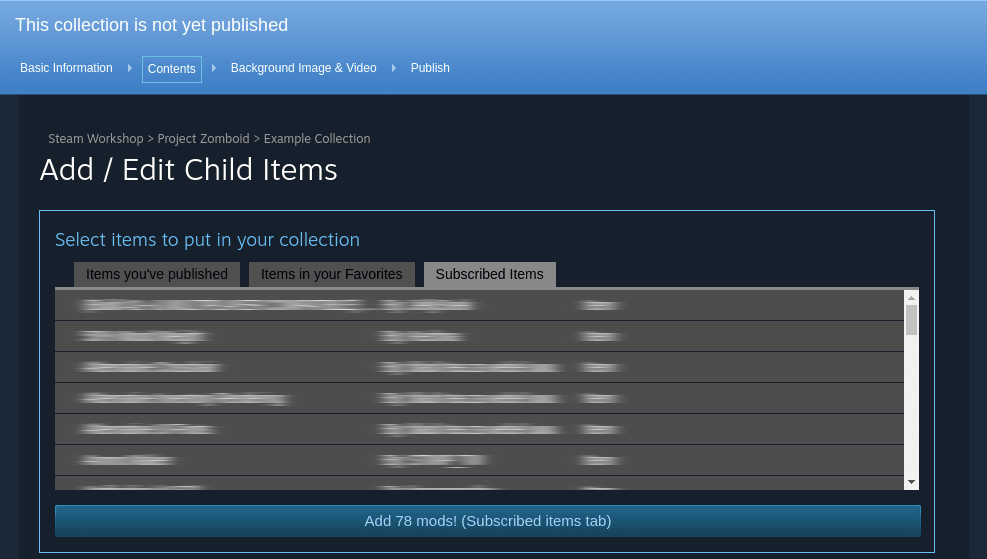

## Installation

1. Download newest release file from: https://github.com/Cryzen1/steam-collection-helper/releases/latest/download/source-code.zip

2. Enable "Developer mode" in extensions tab

3. Unzip downloaded file

4. Click "Load unpacked" and select unzipped directory

5. Everything should be working right now and you should see a big button under the list of mods as shown below

